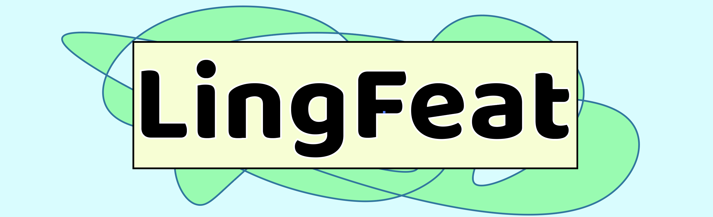

[![CC BY-SA 4.0][cc-by-sa-shield]][cc-by-sa]
[](https://spacy.io)
<a href="https://pypi.org/project/LingFeat"></a>
</a>
</a>
<p align="center"> </p>

# LingFeat - Comprehensive Linguistic Features Extraction Tool for Readability Assessment and Text Simplification
- [LingFeat - Comprehensive Linguistic Features Extraction Tool for Readability Assessment and Text Simplification](#lingfeat---comprehensive-linguistic-features-extraction-tool-for-readability-assessment-and-text-simplification)
  - [Overview](#overview)
  - [Things to note](#things-to-note)
  - [Citation](#citation)
  - [Installation](#installation)
  - [Usage](#usage)
  - [Available Features, Code, Definition](#available-features-code-definition)
  - [Key References](#key-references)
  - [License](#license)
  - [Acknowledgement](#acknowledgement)

## Overview

LingFeat is a Python research package for various handcrafted linguistic features. More specifically, LingFeat is an NLP feature extraction software, which currently extracts 255 linguistic features from **English** string input. 

These features can be divided into five broad linguistic branches:
1. **Advanced Semantic** (AdSem): for measuing complexity of meaning structures (**Not working in some cases. Working on this issue.**)
   - *Semantic Richness, Noise, and Clarity from trained LDA models (included, no training required)*

2. **Discourse** (Disco): for measuring coherence/cohesion
   - *Entity Counts, Entity Grid, and Local Coherence score*

3. **Syntactic** (Synta): for measuring the complexity of grammar and structure
   - *Phrasal Counts (e.g. Noun Phrase), Part-of-Speech Counts, and Tree Structure*

4. **Lexico Semantic** (LxSem): for measuring word/phrasal-specific difficulty
   - *Type Token Ratio, Variation Score (e.g. Verb Variation), Age-of-Acquistion, and SubtlexUS Frequency*

5. **Shallow Traditional** (ShTra): traditional features/formulas for text difficulty
   - *Basic Average Counts (words per sentence), Flesch-Kincaid Reading Ease, Smog, Gunning Fog, ...*

## Things to note
LingFeat is mainly built for text complexity/difficulty/readability analysis or text simplification studies. But it's role is to simply extract numerical linguistic faetures from a text. Hence, the use cases may vary.

We provide guidelines for both basic users and advanced users. Please follow [Usage](#usage) section.

## Citation
This software is built for our paper on 

> @inproceedings{lee-etal-2021-pushing,
> title = "Pushing on Text Readability Assessment: A Transformer Meets Handcrafted Linguistic Features",
> author = "Lee, Bruce W. and Jang, Yoo Sung and Lee, Jason",
> booktitle = "Proceedings of the 2021 Conference on Empirical Methods in Natural Language Processing",
> month = nov,
> year = "2021",
> address = "Online and Punta Cana, Dominican Republic",
> publisher = "Association for Computational Linguistics",
> url = "https://aclanthology.org/2021.emnlp-main.834",
> doi = "10.18653/v1/2021.emnlp-main.834",
> pages = "10669--10686"}

*Please cite our paper and provide link to this repository* if you use in this software in research.

Most supported features are developed for passage analysis. One sentence input will work fine with the program but won't produce reliable output.

## Installation

**Option 1. (Recommended)** Use package manager [pip](https://pip.pypa.io/en/stable/) to install LingFeat. 
```bash
pip install lingfeat
```

**Option 2.** Install from the repo. 

You'll need to install the dependencies, including spaCy, by yourself. Ideally, use virtual environment (optional).

Use code below for option 2.
```bash
git clone https://github.com/brucewlee/lingfeat.git
pip install -r lingfeat/requirements.txt
```
   
## Usage

A. **General Purpose (basic)**

If you aren't deeply interested in linguistics, you usually don't require the full feature set of LingFeat.

The following code returns a dictionary of 6 outputs from commonly used formulas in predicting readability:
- Flesch Kincaid Grade Level *(Feature Code: FleschG_S)*
- Automated Readability Index *(Feature Code: AutoRea_S)*
- Coleman Liau Readability Score *(Feature Code: ColeLia_S)*
- Smog Index *(Feature Code: SmogInd_S)*
- Gunning Fog Count Score *(Feature Code: Gunning_S)*
- Linsear Write Formula Score *(Feature Code: LinseaW_S)*
  
These formulas are a little outdated... but still widely used.

They are designed to match U.S. grade level from 1~12 (i.e. average student of the grade can read the text). 

Ideally, you could average these 6 outputs to obtain a reliable outcome.
```python
from lingfeat import extractor

text = "..."

LingFeat = extractor.pass_text(text)

LingFeat.preprocess()

TraF = LingFeat.TraF_()

print(TraF)

```

B. **Research/ML/NLP Purpose (advanced)**

B.1 ***Spacy Requirements***

This library assumes that you have spaCy sm corpus (that is compatible with spaCy 3.0+) installed. If not, or if you aren't sure, run the following in terminal.
```bash
python -m spacy download en_core_web_sm
```


B.2. ***Example***

Due to the wide number of supported features, we defined *subgroups* for features. Hence, features are not accessible individually. Instead, you'd call the *subgroups* to obtain the dictionary of the corresponding features.

To broadly understand how these features interact with text readability, difficulty, and complexity, I highly suggest you read Section 2 and 3 in our EMNLP paper.
```python
"""
Import

this is the only import you need
"""
from lingfeat import extractor


"""
Pass text

here, text must be in string type
"""
text = "..."
LingFeat = extractor.pass_text(text)


"""
Preprocess text

options (all boolean):
- short (default False): include short words of < 3 letters
- see_token (default False): return token list
- see_sent_token (default False): return tokens in sentences

output:
- n_token
- n_sent
- token_list (optional)
- sent_token_list (optional)
"""
LingFeat.preprocess()
# or
# print(LingFeat.preprocess())


"""
Extract features

each method returns a dictionary of the corresponding features
"""
# Advanced Semantic (AdSem) Features
WoKF = LingFeat.WoKF_() # Wikipedia Knowledge Features
WBKF = LingFeat.WBKF_() # WeeBit Corpus Knowledge Features
OSKF = LingFeat.OSKF_() # OneStopEng Corpus Knowledge Features

# Discourse (Disco) Features
EnDF = LingFeat.EnDF_() # Entity Density Features
EnGF = LingFeat.EnGF_() # Entity Grid Features

# Syntactic (Synta) Features
PhrF = LingFeat.PhrF_() # Noun/Verb/Adj/Adv/... Phrasal Features
TrSF = LingFeat.TrSF_() # (Parse) Tree Structural Features
POSF = LingFeat.POSF_() # Noun/Verb/Adj/Adv/... Part-of-Speech Features

# Lexico Semantic (LxSem) Features
TTRF = LingFeat.TTRF_() # Type Token Ratio Features
VarF = LingFeat.VarF_() # Noun/Verb/Adj/Adv Variation Features 
PsyF = LingFeat.PsyF_() # Psycholinguistic Difficulty of Words (AoA Kuperman)
WoLF = LingFeat.WorF_() # Word Familiarity from Frequency Count (SubtlexUS)

# Shallow Traditional (ShTra) Features
ShaF = LingFeat.ShaF_() # Shallow Features (e.g. avg number of tokens)
TraF = LingFeat.TraF_() # Traditional Formulas 
```


## Available Features, Code, Definition
| idx | Linguistic Branch   | Subgroup Code | Subgroup Definition                  | Feature Code | Feature Definition                                                             |
|-------|---------------------|---------------|--------------------------------------|--------------|--------------------------------------------------------------------------------|
| 1     | AdSem  | WoKF_         | Wiki Knowledge Features             | WRich05_S    | Semantic Richness, 50 topics extracted from Wikipedia                          |
| 2     | AdSem  | WoKF_         | Wiki Knowledge Features             | WClar05_S    | Semantic Clarity, 50 topics extracted from Wikipedia                           |
| 3     | AdSem  | WoKF_         | Wiki Knowledge Features             | WNois05_S    | Semantic Noise, 50 topics extracted from Wikipedia                             |
| 4     | AdSem  | WoKF_         | Wiki Knowledge Features             | WTopc05_S    | Number of topics, 50 topics extracted from Wikipedia                           |
| 5     | AdSem  | WoKF_         | Wiki Knowledge Features             | WRich10_S    | Semantic Richness, 100 topics extracted from Wikipedia                         |
| 6     | AdSem  | WoKF_         | Wiki Knowledge Features             | WClar10_S    | Semantic Clarity, 100 topics extracted from Wikipedia                          |
| 7     | AdSem  | WoKF_         | Wiki Knowledge Features             | WNois10_S    | Semantic Noise, 100 topics extracted from Wikipedia                            |
| 8     | AdSem  | WoKF_         | Wiki Knowledge Features             | WTopc10_S    | Number of topics, 100 topics extracted from Wikipedia                          |
| 9     | AdSem  | WoKF_         | Wiki Knowledge Features             | WRich15_S    | Semantic Richness, 150 topics extracted from Wikipedia                         |
| 10    | AdSem  | WoKF_         | Wiki Knowledge Features             | WClar15_S    | Semantic Clarity, 150 topics extracted from Wikipedia                          |
| 11    | AdSem  | WoKF_         | Wiki Knowledge Features             | WNois15_S    | Semantic Noise, 150 topics extracted from Wikipedia                            |
| 12    | AdSem  | WoKF_         | Wiki Knowledge Features             | WTopc15_S    | Number of topics, 150 topics extracted from Wikipedia                          |
| 13    | AdSem  | WoKF_         | Wiki Knowledge Features             | WRich20_S    | Semantic Richness, 200 topics extracted from Wikipedia                         |
| 14    | AdSem  | WoKF_         | Wiki Knowledge Features             | WClar20_S    | Semantic Clarity, 200 topics extracted from Wikipedia                          |
| 15    | AdSem  | WoKF_         | Wiki Knowledge Features             | WNois20_S    | Semantic Noise, 200 topics extracted from Wikipedia                            |
| 16    | AdSem  | WoKF_         | Wiki Knowledge Features             | WTopc20_S    | Number of topics, 200 topics extracted from Wikipedia                          |
| 17    | AdSem  | WBKF_         | WB Knowledge Features     | BRich05_S    | Semantic Richness, 50 topics extracted from WeeBit Corpus                  |
| 18    | AdSem  | WBKF_         | WB Knowledge Features     | BClar05_S    | Semantic Clarity, 50 topics extracted from WeeBit Corpus                       |
| 19    | AdSem  | WBKF_         | WB Knowledge Features     | BNois05_S    | Semantic Noise, 50 topics extracted from WeeBit Corpus                         |
| 20    | AdSem  | WBKF_         | WB Knowledge Features     | BTopc05_S    | Number of topics, 50 topics extracted from WeeBit Corpus                       |
| 21    | AdSem  | WBKF_         | WB Knowledge Features     | BRich10_S    | Semantic Richness, 100 topics extracted from WeeBit Corpus                 |
| 22    | AdSem  | WBKF_         | WB Knowledge Features     | BClar10_S    | Semantic Clarity, 100 topics extracted from WeeBit Corpus                      |
| 23    | AdSem  | WBKF_         | WB Knowledge Features     | BNois10_S    | Semantic Noise, 100 topics extracted from WeeBit Corpus                        |
| 24    | AdSem  | WBKF_         | WB Knowledge Features     | BTopc10_S    | Number of topics, 100 topics extracted from WeeBit Corpus                      |
| 25    | AdSem  | WBKF_         | WB Knowledge Features     | BRich15_S    | Semantic Richness, 150 topics extracted from WeeBit Corpus                 |
| 26    | AdSem  | WBKF_         | WB Knowledge Features     | BClar15_S    | Semantic Clarity, 150 topics extracted from WeeBit Corpus                      |
| 27    | AdSem  | WBKF_         | WB Knowledge Features     | BNois15_S    | Semantic Noise, 150 topics extracted from WeeBit Corpus                        |
| 28    | AdSem  | WBKF_         | WB Knowledge Features     | BTopc15_S    | Number of topics, 150 topics extracted from WeeBit Corpus                      |
| 29    | AdSem  | WBKF_         | WB Knowledge Features     | BRich20_S    | Semantic Richness, 200 topics extracted from WeeBit Corpus                 |
| 30    | AdSem  | WBKF_         | WB Knowledge Features     | BClar20_S    | Semantic Clarity, 200 topics extracted from WeeBit Corpus                      |
| 31    | AdSem  | WBKF_         | WB Knowledge Features     | BNois20_S    | Semantic Noise, 200 topics extracted from WeeBit Corpus                        |
| 32    | AdSem  | WBKF_         | WB Knowledge Features     | BTopc20_S    | Number of topics, 200 topics extracted from WeeBit Corpus                      |
| 33    | AdSem  | OSKF_         | OSE Knowledge Features | ORich05_S    | Semantic Richness, 50 topics extracted from OneStopEng Corpus              |
| 34    | AdSem  | OSKF_         | OSE Knowledge Features | OClar05_S    | Semantic Clarity, 50 topics extracted from OneStopEng Corpus                   |
| 35    | AdSem  | OSKF_         | OSE Knowledge Features | ONois05_S    | Semantic Noise, 50 topics extracted from OneStopEng Corpus                     |
| 36    | AdSem  | OSKF_         | OSE Knowledge Features | OTopc05_S    | Number of topics, 50 topics extracted from OneStopEng Corpus                   |
| 37    | AdSem  | OSKF_         | OSE Knowledge Features | ORich10_S    | Semantic Richness, 100 topics extracted from OneStopEng Corpus             |
| 38    | AdSem  | OSKF_         | OSE Knowledge Features | OClar10_S    | Semantic Clarity, 100 topics extracted from OneStopEng Corpus                  |
| 39    | AdSem  | OSKF_         | OSE Knowledge Features | ONois10_S    | Semantic Noise, 100 topics extracted from OneStopEng Corpus                    |
| 40    | AdSem  | OSKF_         | OSE Knowledge Features | OTopc10_S    | Number of topics, 100 topics extracted from OneStopEng Corpus                  |
| 41    | AdSem  | OSKF_         | OSE Knowledge Features | ORich15_S    | Semantic Richness, 150 topics extracted from OneStopEng Corpus             |
| 42    | AdSem  | OSKF_         | OSE Knowledge Features | OClar15_S    | Semantic Clarity, 150 topics extracted from OneStopEng Corpus                  |
| 43    | AdSem  | OSKF_         | OSE Knowledge Features | ONois15_S    | Semantic Noise, 150 topics extracted from OneStopEng Corpus                    |
| 44    | AdSem  | OSKF_         | OSE Knowledge Features | OTopc15_S    | Number of topics, 150 topics extracted from OneStopEng Corpus                  |
| 45    | AdSem  | OSKF_         | OSE Knowledge Features | ORich20_S    | Semantic Richness, 200 topics extracted from OneStopEng Corpus             |
| 46    | AdSem  | OSKF_         | OSE Knowledge Features | OClar20_S    | Semantic Clarity, 200 topics extracted from OneStopEng Corpus                  |
| 47    | AdSem  | OSKF_         | OSE Knowledge Features | ONois20_S    | Semantic Noise, 200 topics extracted from OneStopEng Corpus                    |
| 48    | AdSem  | OSKF_         | OSE Knowledge Features | OTopc20_S    | Number of topics, 200 topics extracted from OneStopEng Corpus                  |
| 49    | Disco           | EnDF_         | Entity Density Features              | to_EntiM_C   | total number of Entities Mentions counts                                       |
| 50    | Disco           | EnDF_         | Entity Density Features              | as_EntiM_C   | average number of Entities Mentions counts per sentence                        |
| 51    | Disco           | EnDF_         | Entity Density Features              | at_EntiM_C   | average number of Entities Mentions counts per token (word)                    |
| 52    | Disco           | EnDF_         | Entity Density Features              | to_UEnti_C   | total number of unique Entities                                                |
| 53    | Disco           | EnDF_         | Entity Density Features              | as_UEnti_C   | average number of unique Entities per sentence                                 |
| 54    | Disco           | EnDF_         | Entity Density Features              | at_UEnti_C   | average number of unique Entities per token (word)                             |
| 55    | Disco           | EnGF_         | Entity Grid Features                 | ra_SSToT_C   | ratio of ss transitions to total                                               |
| 56    | Disco           | EnGF_         | Entity Grid Features                 | ra_SOToT_C   | ratio of so transitions to total                                               |
| 57    | Disco           | EnGF_         | Entity Grid Features                 | ra_SXToT_C   | ratio of sx transitions to total                                               |
| 58    | Disco           | EnGF_         | Entity Grid Features                 | ra_SNToT_C   | ratio of sn transitions to total                                               |
| 59    | Disco           | EnGF_         | Entity Grid Features                 | ra_OSToT_C   | ratio of os transitions to total                                               |
| 60    | Disco           | EnGF_         | Entity Grid Features                 | ra_OOToT_C   | ratio of oo transitions to total                                               |
| 61    | Disco           | EnGF_         | Entity Grid Features                 | ra_OXToT_C   | ratio of ox transitions to total                                               |
| 62    | Disco           | EnGF_         | Entity Grid Features                 | ra_ONToT_C   | ratio of on transitions to total                                               |
| 63    | Disco           | EnGF_         | Entity Grid Features                 | ra_XSToT_C   | ratio of xs transitions to total                                               |
| 64    | Disco           | EnGF_         | Entity Grid Features                 | ra_XOToT_C   | ratio of xo transitions to total                                               |
| 65    | Disco           | EnGF_         | Entity Grid Features                 | ra_XXToT_C   | ratio of xx transitions to total                                               |
| 66    | Disco           | EnGF_         | Entity Grid Features                 | ra_XNToT_C   | ratio of xn transitions to total                                               |
| 67    | Disco           | EnGF_         | Entity Grid Features                 | ra_NSToT_C   | ratio of ns transitions to total                                               |
| 68    | Disco           | EnGF_         | Entity Grid Features                 | ra_NOToT_C   | ratio of no transitions to total                                               |
| 69    | Disco           | EnGF_         | Entity Grid Features                 | ra_NXToT_C   | ratio of nx transitions to total                                               |
| 70    | Disco           | EnGF_         | Entity Grid Features                 | ra_NNToT_C   | ratio of nn transitions to total                                               |
| 71    | Disco           | EnGF_         | Entity Grid Features                 | LoCohPA_S    | Local Coherence for PA score                                                   |
| 72    | Disco           | EnGF_         | Entity Grid Features                 | LoCohPW_S    | Local Coherence for PW score                                                   |
| 73    | Disco           | EnGF_         | Entity Grid Features                 | LoCohPU_S    | Local Coherence for PU score                                                   |
| 74    | Disco           | EnGF_         | Entity Grid Features                 | LoCoDPA_S    | Local Coherence distance for PA score                                          |
| 75    | Disco           | EnGF_         | Entity Grid Features                 | LoCoDPW_S    | Local Coherence distance for PW score                                          |
| 76    | Disco           | EnGF_         | Entity Grid Features                 | LoCoDPU_S    | Local Coherence distance for PU score                                          |
| 77    | Synta           | PhrF_         | Phrasal Features                     | to_NoPhr_C   | total count of Noun phrases                                                    |
| 78    | Synta           | PhrF_         | Phrasal Features                     | as_NoPhr_C   | average count of Noun phrases per sentence                                     |
| 79    | Synta           | PhrF_         | Phrasal Features                     | at_NoPhr_C   | average count of Noun phrases per token                                        |
| 80    | Synta           | PhrF_         | Phrasal Features                     | ra_NoVeP_C   | ratio of Noun phrases count to Verb phrases count                              |
| 81    | Synta           | PhrF_         | Phrasal Features                     | ra_NoSuP_C   | ratio of Noun phrases count to Subordinate Clauses count                       |
| 82    | Synta           | PhrF_         | Phrasal Features                     | ra_NoPrP_C   | ratio of Noun phrases count to Prep phrases count                              |
| 83    | Synta           | PhrF_         | Phrasal Features                     | ra_NoAjP_C   | ratio of Noun phrases count to Adj phrases count                               |
| 84    | Synta           | PhrF_         | Phrasal Features                     | ra_NoAvP_C   | ratio of Noun phrases count to Adv phrases count                               |
| 85    | Synta           | PhrF_         | Phrasal Features                     | to_VePhr_C   | total count of Verb phrases                                                    |
| 86    | Synta           | PhrF_         | Phrasal Features                     | as_VePhr_C   | average count of Verb phrases per sentence                                     |
| 87    | Synta           | PhrF_         | Phrasal Features                     | at_VePhr_C   | average count of Verb phrases per token                                        |
| 88    | Synta           | PhrF_         | Phrasal Features                     | ra_VeNoP_C   | ratio of Verb phrases count to Noun phrases count                              |
| 89    | Synta           | PhrF_         | Phrasal Features                     | ra_VeSuP_C   | ratio of Verb phrases count to Subordinate Clauses count                       |
| 90    | Synta           | PhrF_         | Phrasal Features                     | ra_VePrP_C   | ratio of Verb phrases count to Prep phrases count                              |
| 91    | Synta           | PhrF_         | Phrasal Features                     | ra_VeAjP_C   | ratio of Verb phrases count to Adj phrases count                               |
| 92    | Synta           | PhrF_         | Phrasal Features                     | ra_VeAvP_C   | ratio of Verb phrases count to Adv phrases count                               |
| 93    | Synta           | PhrF_         | Phrasal Features                     | to_SuPhr_C   | total count of Subordinate Clauses                                             |
| 94    | Synta           | PhrF_         | Phrasal Features                     | as_SuPhr_C   | average count of Subordinate Clauses per sentence                              |
| 95    | Synta           | PhrF_         | Phrasal Features                     | at_SuPhr_C   | average count of Subordinate Clauses per token                                 |
| 96    | Synta           | PhrF_         | Phrasal Features                     | ra_SuNoP_C   | ratio of Subordinate Clauses count to Noun phrases count                       |
| 97    | Synta           | PhrF_         | Phrasal Features                     | ra_SuVeP_C   | ratio of Subordinate Clauses count to Verb phrases count                       |
| 98    | Synta           | PhrF_         | Phrasal Features                     | ra_SuPrP_C   | ratio of Subordinate Clauses count to Prep phrases count                       |
| 99    | Synta           | PhrF_         | Phrasal Features                     | ra_SuAjP_C   | ratio of Subordinate Clauses count to Adj phrases count                        |
| 100   | Synta           | PhrF_         | Phrasal Features                     | ra_SuAvP_C   | ratio of Subordinate Clauses count to Adv phrases count                        |
| 101   | Synta           | PhrF_         | Phrasal Features                     | to_PrPhr_C   | total count of prepositional phrases                                           |
| 102   | Synta           | PhrF_         | Phrasal Features                     | as_PrPhr_C   | average count of prepositional phrases per sentence                            |
| 103   | Synta           | PhrF_         | Phrasal Features                     | at_PrPhr_C   | average count of prepositional phrases per token                               |
| 104   | Synta           | PhrF_         | Phrasal Features                     | ra_PrNoP_C   | ratio of Prep phrases count to Noun phrases count                              |
| 105   | Synta           | PhrF_         | Phrasal Features                     | ra_PrVeP_C   | ratio of Prep phrases count to Verb phrases count                              |
| 106   | Synta           | PhrF_         | Phrasal Features                     | ra_PrSuP_C   | ratio of Prep phrases count to Subordinate Clauses count                       |
| 107   | Synta           | PhrF_         | Phrasal Features                     | ra_PrAjP_C   | ratio of Prep phrases count to Adj phrases count                               |
| 108   | Synta           | PhrF_         | Phrasal Features                     | ra_PrAvP_C   | ratio of Prep phrases count to Adv phrases count                               |
| 109   | Synta           | PhrF_         | Phrasal Features                     | to_AjPhr_C   | total count of Adjective phrases                                               |
| 110   | Synta           | PhrF_         | Phrasal Features                     | as_AjPhr_C   | average count of Adjective phrases per sentence                                |
| 111   | Synta           | PhrF_         | Phrasal Features                     | at_AjPhr_C   | average count of Adjective phrases per token                                   |
| 112   | Synta           | PhrF_         | Phrasal Features                     | ra_AjNoP_C   | ratio of Adj phrases count to Noun phrases count                               |
| 113   | Synta           | PhrF_         | Phrasal Features                     | ra_AjVeP_C   | ratio of Adj phrases count to Verb phrases count                               |
| 114   | Synta           | PhrF_         | Phrasal Features                     | ra_AjSuP_C   | ratio of Adj phrases count to Subordinate Clauses count                        |
| 115   | Synta           | PhrF_         | Phrasal Features                     | ra_AjPrP_C   | ratio of Adj phrases count to Prep phrases count                               |
| 116   | Synta           | PhrF_         | Phrasal Features                     | ra_AjAvP_C   | ratio of Adj phrases count to Adv phrases count                                |
| 117   | Synta           | PhrF_         | Phrasal Features                     | to_AvPhr_C   | total count of Adverb phrases                                                  |
| 118   | Synta           | PhrF_         | Phrasal Features                     | as_AvPhr_C   | average count of Adverb phrases per sentence                                   |
| 119   | Synta           | PhrF_         | Phrasal Features                     | at_AvPhr_C   | average count of Adverb phrases per token                                      |
| 120   | Synta           | PhrF_         | Phrasal Features                     | ra_AvNoP_C   | ratio of Adv phrases count to Noun phrases count                               |
| 121   | Synta           | PhrF_         | Phrasal Features                     | ra_AvVeP_C   | ratio of Adv phrases count to Verb phrases count                               |
| 122   | Synta           | PhrF_         | Phrasal Features                     | ra_AvSuP_C   | ratio of Adv phrases count to Subordinate Clauses count                        |
| 123   | Synta           | PhrF_         | Phrasal Features                     | ra_AvPrP_C   | ratio of Adv phrases count to Prep phrases count                               |
| 124   | Synta           | PhrF_         | Phrasal Features                     | ra_AvAjP_C   | ratio of Adv phrases count to Adj phrases count                                |
| 125   | Synta           | TrSF_         | Tree Structure Features              | to_TreeH_C   | total Tree height of all sentences                                             |
| 126   | Synta           | TrSF_         | Tree Structure Features              | as_TreeH_C   | average Tree height per sentence                                               |
| 127   | Synta           | TrSF_         | Tree Structure Features              | at_TreeH_C   | average Tree height per token (word)                                           |
| 128   | Synta           | TrSF_         | Tree Structure Features              | to_FTree_C   | total length of flattened Trees                                                |
| 129   | Synta           | TrSF_         | Tree Structure Features              | as_FTree_C   | average length of flattened Trees per sentence                                 |
| 130   | Synta           | TrSF_         | Tree Structure Features              | at_FTree_C   | average length of flattened Trees per token (word)                             |
| 131   | Synta           | POSF_         | Part-of-Speech Features              | to_NoTag_C   | total count of Noun POS tags                                                   |
| 132   | Synta           | POSF_         | Part-of-Speech Features              | as_NoTag_C   | average count of Noun POS tags per sentence                                    |
| 133   | Synta           | POSF_         | Part-of-Speech Features              | at_NoTag_C   | average count of Noun POS tags per token                                       |
| 134   | Synta           | POSF_         | Part-of-Speech Features              | ra_NoAjT_C   | ratio of Noun POS count to Adjective POS count                                 |
| 135   | Synta           | POSF_         | Part-of-Speech Features              | ra_NoVeT_C   | ratio of Noun POS count to Verb POS count                                      |
| 136   | Synta           | POSF_         | Part-of-Speech Features              | ra_NoAvT_C   | ratio of Noun POS count to Adverb POS count                                    |
| 137   | Synta           | POSF_         | Part-of-Speech Features              | ra_NoSuT_C   | ratio of Noun POS count to Subordinating Conjunction count                     |
| 138   | Synta           | POSF_         | Part-of-Speech Features              | ra_NoCoT_C   | ratio of Noun POS count to Coordinating Conjunction count                      |
| 139   | Synta           | POSF_         | Part-of-Speech Features              | to_VeTag_C   | total count of Verb POS tags                                                   |
| 140   | Synta           | POSF_         | Part-of-Speech Features              | as_VeTag_C   | average count of Verb POS tags per sentence                                    |
| 141   | Synta           | POSF_         | Part-of-Speech Features              | at_VeTag_C   | average count of Verb POS tags per token                                       |
| 142   | Synta           | POSF_         | Part-of-Speech Features              | ra_VeAjT_C   | ratio of Verb POS count to Adjective POS count                                 |
| 143   | Synta           | POSF_         | Part-of-Speech Features              | ra_VeNoT_C   | ratio of Verb POS count to Noun POS count                                      |
| 144   | Synta           | POSF_         | Part-of-Speech Features              | ra_VeAvT_C   | ratio of Verb POS count to Adverb POS count                                    |
| 145   | Synta           | POSF_         | Part-of-Speech Features              | ra_VeSuT_C   | ratio of Verb POS count to Subordinating Conjunction count                     |
| 146   | Synta           | POSF_         | Part-of-Speech Features              | ra_VeCoT_C   | ratio of Verb POS count to Coordinating Conjunction count                      |
| 147   | Synta           | POSF_         | Part-of-Speech Features              | to_AjTag_C   | total count of Adjective POS tags                                              |
| 148   | Synta           | POSF_         | Part-of-Speech Features              | as_AjTag_C   | average count of Adjective POS tags per sentence                               |
| 149   | Synta           | POSF_         | Part-of-Speech Features              | at_AjTag_C   | average count of Adjective POS tags per token                                  |
| 150   | Synta           | POSF_         | Part-of-Speech Features              | ra_AjNoT_C   | ratio of Adjective POS count to Noun POS count                                 |
| 151   | Synta           | POSF_         | Part-of-Speech Features              | ra_AjVeT_C   | ratio of Adjective POS count to Verb POS count                                 |
| 152   | Synta           | POSF_         | Part-of-Speech Features              | ra_AjAvT_C   | ratio of Adjective POS count to Adverb POS count                               |
| 153   | Synta           | POSF_         | Part-of-Speech Features              | ra_AjSuT_C   | ratio of Adjective POS count to Subordinating Conjunction count                |
| 154   | Synta           | POSF_         | Part-of-Speech Features              | ra_AjCoT_C   | ratio of Adjective POS count to Coordinating Conjunction count                 |
| 155   | Synta           | POSF_         | Part-of-Speech Features              | to_AvTag_C   | total count of Adverb POS tags                                                 |
| 156   | Synta           | POSF_         | Part-of-Speech Features              | as_AvTag_C   | average count of Adverb POS tags per sentence                                  |
| 157   | Synta           | POSF_         | Part-of-Speech Features              | at_AvTag_C   | average count of Adverb POS tags per token                                     |
| 158   | Synta           | POSF_         | Part-of-Speech Features              | ra_AvAjT_C   | ratio of Adverb POS count to Adjective POS count                               |
| 159   | Synta           | POSF_         | Part-of-Speech Features              | ra_AvNoT_C   | ratio of Adverb POS count to Noun POS count                                    |
| 160   | Synta           | POSF_         | Part-of-Speech Features              | ra_AvVeT_C   | ratio of Adverb POS count to Verb POS count                                    |
| 161   | Synta           | POSF_         | Part-of-Speech Features              | ra_AvSuT_C   | ratio of Adverb POS count to Subordinating Conjunction count                   |
| 162   | Synta           | POSF_         | Part-of-Speech Features              | ra_AvCoT_C   | ratio of Adverb POS count to Coordinating Conjunction count                    |
| 163   | Synta           | POSF_         | Part-of-Speech Features              | to_SuTag_C   | total count of Subordinating Conjunction POS tags                              |
| 164   | Synta           | POSF_         | Part-of-Speech Features              | as_SuTag_C   | average count of Subordinating Conjunction POS tags per sentence               |
| 165   | Synta           | POSF_         | Part-of-Speech Features              | at_SuTag_C   | average count of Subordinating Conjunction POS tags per token                  |
| 166   | Synta           | POSF_         | Part-of-Speech Features              | ra_SuAjT_C   | ratio of Subordinating Conjunction POS count to Adjective POS count            |
| 167   | Synta           | POSF_         | Part-of-Speech Features              | ra_SuNoT_C   | ratio of Subordinating Conjunction POS count to Noun POS count                 |
| 168   | Synta           | POSF_         | Part-of-Speech Features              | ra_SuVeT_C   | ratio of Subordinating Conjunction POS count to Verb POS count                 |
| 169   | Synta           | POSF_         | Part-of-Speech Features              | ra_SuAvT_C   | ratio of Subordinating Conjunction POS count to Adverb POS count               |
| 170   | Synta           | POSF_         | Part-of-Speech Features              | ra_SuCoT_C   | ratio of Subordinating Conjunction POS count to Coordinating Conjunction count |
| 171   | Synta           | POSF_         | Part-of-Speech Features              | to_CoTag_C   | total count of Coordinating Conjunction POS tags                               |
| 172   | Synta           | POSF_         | Part-of-Speech Features              | as_CoTag_C   | average count of Coordinating Conjunction POS tags per sentence                |
| 173   | Synta           | POSF_         | Part-of-Speech Features              | at_CoTag_C   | average count of Coordinating Conjunction POS tags per token                   |
| 174   | Synta           | POSF_         | Part-of-Speech Features              | ra_CoAjT_C   | ratio of Coordinating Conjunction POS count to Adjective POS count             |
| 175   | Synta           | POSF_         | Part-of-Speech Features              | ra_CoNoT_C   | ratio of Coordinating Conjunction POS count to Noun POS count                  |
| 176   | Synta           | POSF_         | Part-of-Speech Features              | ra_CoVeT_C   | ratio of Coordinating Conjunction POS count to Verb POS count                  |
| 177   | Synta           | POSF_         | Part-of-Speech Features              | ra_CoAvT_C   | ratio of Coordinating Conjunction POS count to Adverb POS count                |
| 178   | Synta           | POSF_         | Part-of-Speech Features              | ra_CoSuT_C   | ratio of Coordinating Conjunction POS count to Subordinating Conjunction count |
| 179   | Synta           | POSF_         | Part-of-Speech Features              | to_ContW_C   | total count of Content words                                                   |
| 180   | Synta           | POSF_         | Part-of-Speech Features              | as_ContW_C   | average count of Content words per sentence                                    |
| 181   | Synta           | POSF_         | Part-of-Speech Features              | at_ContW_C   | average count of Content words per token                                       |
| 182   | Synta           | POSF_         | Part-of-Speech Features              | to_FuncW_C   | total count of Function words                                                  |
| 183   | Synta           | POSF_         | Part-of-Speech Features              | as_FuncW_C   | average count of Function words per sentence                                   |
| 184   | Synta           | POSF_         | Part-of-Speech Features              | at_FuncW_C   | average count of Function words per token                                      |
| 185   | Synta           | POSF_         | Part-of-Speech Features              | ra_CoFuW_C   | ratio of Content words to Function words                                       |
| 186   | LxSem     | VarF_         | Variation Ratio Features             | SimpNoV_S    | unique Nouns/total Nouns (Noun Variation-1)                                    |
| 187   | LxSem     | VarF_         | Variation Ratio Features             | SquaNoV_S    | (unique Nouns**2)/total Nouns (Squared Noun Variation-1)                       |
| 188   | LxSem     | VarF_         | Variation Ratio Features             | CorrNoV_S    | unique Nouns/sqrt(2*total Nouns) (Corrected Noun Variation-1)                  |
| 189   | LxSem     | VarF_         | Variation Ratio Features             | SimpVeV_S    | unique Verbs/total Verbs (Verb Variation-1)                                    |
| 190   | LxSem     | VarF_         | Variation Ratio Features             | SquaVeV_S    | (unique Verbs**2)/total Verbs (Squared Verb Variation-1)                       |
| 191   | LxSem     | VarF_         | Variation Ratio Features             | CorrVeV_S    | unique Verbs/sqrt(2*total Verbs) (Corrected Verb Variation-1)                  |
| 192   | LxSem     | VarF_         | Variation Ratio Features             | SimpAjV_S    | unique Adjectives/total Adjectives (Adjective Variation-1)                     |
| 193   | LxSem     | VarF_         | Variation Ratio Features             | SquaAjV_S    | (unique Adjectives**2)/total Adjectives (Squared Adjective Variation-1)        |
| 194   | LxSem     | VarF_         | Variation Ratio Features             | CorrAjV_S    | unique Adjectives/sqrt(2*total Adjectives) (Corrected Adjective Variation-1)   |
| 195   | LxSem     | VarF_         | Variation Ratio Features             | SimpAvV_S    | unique Adverbs/total Adverbs (AdVerb Variation-1)                              |
| 196   | LxSem     | VarF_         | Variation Ratio Features             | SquaAvV_S    | (unique Adverbs**2)/total Adverbs (Squared AdVerb Variation-1)                 |
| 197   | LxSem     | VarF_         | Variation Ratio Features             | CorrAvV_S    | unique Adverbs/sqrt(2*total Adverbs) (Corrected AdVerb Variation-1)            |
| 198   | LxSem     | TTRF_         | Type Token Ratio Features            | SimpTTR_S    | unique tokens/total tokens (TTR)                                               |
| 199   | LxSem     | TTRF_         | Type Token Ratio Features            | CorrTTR_S    | unique tokens/sqrt(2*total tokens) (Corrected TTR)                             |
| 200   | LxSem     | TTRF_         | Type Token Ratio Features            | BiLoTTR_S    | log(unique tokens)/log(total tokens) (Bi-Logarithmic TTR)                      |
| 201   | LxSem     | TTRF_         | Type Token Ratio Features            | UberTTR_S    | (log(unique tokens))^2/log(total tokens/unique tokens) (Uber Index)            |
| 202   | LxSem     | TTRF_         | Type Token Ratio Features            | MTLDTTR_S    | Measure of Textual Lexical Diversity (default TTR = 0.72)                      |
| 203   | LxSem     | PsyF_         | Psycholinguistic Features            | to_AAKuW_C   | total AoA (Age of Acquisition) of words                                        |
| 204   | LxSem     | PsyF_         | Psycholinguistic Features            | as_AAKuW_C   | average AoA of words per sentence                                              |
| 205   | LxSem     | PsyF_         | Psycholinguistic Features            | at_AAKuW_C   | average AoA of words per token                                                 |
| 206   | LxSem     | PsyF_         | Psycholinguistic Features            | to_AAKuL_C   | total lemmas AoA of lemmas                                                     |
| 207   | LxSem     | PsyF_         | Psycholinguistic Features            | as_AAKuL_C   | average lemmas AoA of lemmas per sentence                                      |
| 208   | LxSem     | PsyF_         | Psycholinguistic Features            | at_AAKuL_C   | average lemmas AoA of lemmas per token                                         |
| 209   | LxSem     | PsyF_         | Psycholinguistic Features            | to_AABiL_C   | total lemmas AoA of lemmas, Bird norm                                          |
| 210   | LxSem     | PsyF_         | Psycholinguistic Features            | as_AABiL_C   | average lemmas AoA of lemmas, Bird norm per sentence                           |
| 211   | LxSem     | PsyF_         | Psycholinguistic Features            | at_AABiL_C   | average lemmas AoA of lemmas, Bird norm per token                              |
| 212   | LxSem     | PsyF_         | Psycholinguistic Features            | to_AABrL_C   | total lemmas AoA of lemmas, Bristol norm                                       |
| 213   | LxSem     | PsyF_         | Psycholinguistic Features            | as_AABrL_C   | average lemmas AoA of lemmas, Bristol norm per sentence                        |
| 214   | LxSem     | PsyF_         | Psycholinguistic Features            | at_AABrL_C   | average lemmas AoA of lemmas, Bristol norm per token                           |
| 215   | LxSem     | PsyF_         | Psycholinguistic Features            | to_AACoL_C   | total AoA of lemmas, Cortese and Khanna norm                                   |
| 216   | LxSem     | PsyF_         | Psycholinguistic Features            | as_AACoL_C   | average AoA of lemmas, Cortese and Khanna norm per sentence                    |
| 217   | LxSem     | PsyF_         | Psycholinguistic Features            | at_AACoL_C   | average AoA of lemmas, Cortese and Khanna norm per token                       |
| 218   | LxSem     | WorF_         | Word Familiarity              | to_SbFrQ_C   | total SubtlexUS FREQcount value                                                |
| 219   | LxSem     | WorF_         | Word Familiarity              | as_SbFrQ_C   | average SubtlexUS FREQcount value per sentenc                                  |
| 220   | LxSem     | WorF_         | Word Familiarity              | at_SbFrQ_C   | average SubtlexUS FREQcount value per token                                    |
| 221   | LxSem     | WorF_         | Word Familiarity              | to_SbCDC_C   | total SubtlexUS CDcount value                                                  |
| 222   | LxSem     | WorF_         | Word Familiarity              | as_SbCDC_C   | average SubtlexUS CDcount value per sentence                                   |
| 223   | LxSem     | WorF_         | Word Familiarity              | at_SbCDC_C   | average SubtlexUS CDcount value per token                                      |
| 224   | LxSem     | WorF_         | Word Familiarity              | to_SbFrL_C   | total SubtlexUS FREQlow value                                                  |
| 225   | LxSem     | WorF_         | Word Familiarity              | as_SbFrL_C   | average SubtlexUS FREQlow value per sentence                                   |
| 226   | LxSem     | WorF_         | Word Familiarity              | at_SbFrL_C   | average SubtlexUS FREQlow value per token                                      |
| 227   | LxSem     | WorF_         | Word Familiarity              | to_SbCDL_C   | total SubtlexUS CDlow value                                                    |
| 228   | LxSem     | WorF_         | Word Familiarity              | as_SbCDL_C   | average SubtlexUS CDlow value per sentence                                     |
| 229   | LxSem     | WorF_         | Word Familiarity              | at_SbCDL_C   | average SubtlexUS CDlow value per token                                        |
| 230   | LxSem     | WorF_         | Word Familiarity              | to_SbSBW_C   | total SubtlexUS SUBTLWF value                                                  |
| 231   | LxSem     | WorF_         | Word Familiarity              | as_SbSBW_C   | average SubtlexUS SUBTLWF value per sentence                                   |
| 232   | LxSem     | WorF_         | Word Familiarity              | at_SbSBW_C   | average SubtlexUS SUBTLWF value per token                                      |
| 233   | LxSem     | WorF_         | Word Familiarity              | to_SbL1W_C   | total SubtlexUS Lg10WF value                                                   |
| 234   | LxSem     | WorF_         | Word Familiarity              | as_SbL1W_C   | average SubtlexUS Lg10WF value per sentence                                    |
| 235   | LxSem     | WorF_         | Word Familiarity              | at_SbL1W_C   | average SubtlexUS Lg10WF value per token                                       |
| 236   | LxSem     | WorF_         | Word Familiarity              | to_SbSBC_C   | total SubtlexUS SUBTLCD value                                                  |
| 237   | LxSem     | WorF_         | Word Familiarity              | as_SbSBC_C   | average SubtlexUS SUBTLCD value per sentence                                   |
| 238   | LxSem     | WorF_         | Word Familiarity              | at_SbSBC_C   | average SubtlexUS SUBTLCD value per token                                      |
| 239   | LxSem     | WorF_         | Word Familiarity              | to_SbL1C_C   | total SubtlexUS Lg10CD value                                                   |
| 240   | LxSem     | WorF_         | Word Familiarity              | as_SbL1C_C   | average SubtlexUS Lg10CD value per sentence                                    |
| 241   | LxSem     | WorF_         | Word Familiarity              | at_SbL1C_C   | average SubtlexUS Lg10CD value per token                                       |
| 242   | ShaTr     | ShaF_         | Shallow Features                     | TokSenM_S   | total count of tokens x total count of sentence                                |
| 243   | ShaTr     | ShaF_         | Shallow Features                     | TokSenS_S   | sqrt(total count of tokens x total count of sentence)                                |
| 244   | ShaTr     | ShaF_         | Shallow Features                     | TokSenL_S   | log(total count of tokens)/log(total count of sentence)                           |
| 245   | ShaTr     | ShaF_         | Shallow Features                     | as_Token_C   | average count of tokens per sentence                                           |
| 246   | ShaTr     | ShaF_         | Shallow Features                     | as_Sylla_C   | average count of syllables per sentence                                        |
| 247   | ShaTr     | ShaF_         | Shallow Features                     | at_Sylla_C         | average count of syllables per token                                           |
| 248   | ShaTr     | ShaF_         | Shallow Features                     | as_Chara_C   | average count of characters per sentence                                       |
| 249   | ShaTr     | ShaF_         | Shallow Features                     | at_Chara_C   | average count of characters per token                                          |
| 250   | ShaTr     | TraF_         | Traditional Formulas         | SmogInd_S    | Smog Index                                                                     |
| 251   | ShaTr     | TraF_         | Traditional Formulas         | ColeLia_S    | Coleman Liau Readability Score                                                 |
| 252   | ShaTr     | TraF_         | Traditional Formulas         | Gunning_S    | Gunning Fog Count Score                                                                    |
| 253   | ShaTr     | TraF_         | Traditional Formulas         | AutoRea_S    | New Automated Readability Index                                                    |
| 254   | ShaTr     | TraF_         | Traditional Formulas         | FleschG_S    | Flesch Kincaid Grade Level                                                           |
| 255   | ShaTr     | TraF_         | Traditional Formulas         | LinseaW_S    | Linsear Write Formula Score                                                                  |


## Key References
We list only the key references here. Check our paper for full references.

**Entity Density Features**
> Feng, Lijun, Noémie Elhadad, and Matt Huenerfauth. "Cognitively motivated features for readability assessment." Proceedings of the 12th Conference of the European Chapter of the ACL (EACL 2009). 2009.

**Entity Grid Features**
> Palma, Diego, and John Atkinson. "Coherence-based automatic essay assessment." IEEE Intelligent Systems 33.5 (2018): 26-36.
Repository: <https://github.com/dpalmasan/TRUNAJOD2.0>

**Variation Features**
> Lu, Xiaofei. "A corpus‐based evaluation of syntactic complexity measures as indices of college‐level ESL writers' language development." TESOL quarterly 45.1 (2011): 36-62.

**Psycholinguistic Features**
> Kuperman, Victor, Hans Stadthagen-Gonzalez, and Marc Brysbaert. "Age-of-acquisition ratings for 30,000 English words." Behavior research methods 44.4 (2012): 978-990.

**Traditional Formulas**
> Kincaid, J. Peter, Robert P. Fishburne Jr, Richard L. Rogers, and Brad S. Chissom. Derivation of new readability formulas (automated readability index, fog count and flesch reading ease formula) for navy enlisted personnel. Naval Technical Training Command Millington TN Research Branch, 1975.


## License
We license LingFeat source code under [Creative Commons Attribution Share Alike 4.0 license (CC-BY-SA-4.0)](https://creativecommons.org/licenses/by-sa/4.0/legalcode).

Under CC-BY-SA-4.0 license, you are allowed to distribute, modify, or privately use this repository.

But patent use, trademark use, and warranty use are not permitted. **Research, code, or etc. that builds on top of LingFeat must be released under the same license.** Alternatively, **a similar open source license may be used.**


## Acknowledgement
I made this software during my time at LXPER AI, Seoul, South Korea. We decided to make this software openly available strictly for academic research purpose only.

I thank the firm and all other members of the R&D department for making this research possible.

[cc-by-sa]: http://creativecommons.org/licenses/by-sa/4.0/
[cc-by-sa-image]: https://licensebuttons.net/l/by-sa/4.0/88x31.png
[cc-by-sa-shield]: https://img.shields.io/badge/License-CC%20BY--SA%204.0-lightgrey.svg
